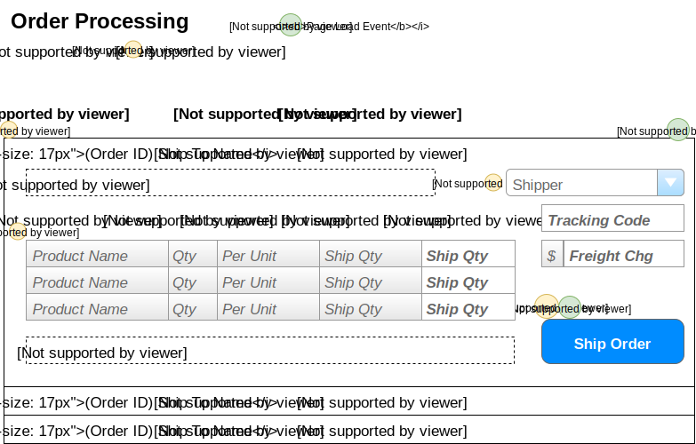

# Order Processing

> Orders are shipped directly from our suppliers to our customers. As such, suppliers log onto our system to see what orders there are for the products that they provide.

## User Interface

Suppliers will be interacting with a page that shows the following information.


The information shown here will be displayed in a **ListView**, using the *EditItemTemplate* as the part that shows the details for a given order.

##Events and Interactions


-  - **Page_Load** event
    -  - Supplier/Contact names obtained from who the logged-in user is
    -  - Load the ListView data from the BLL 
        - **`List<OutstandingOrder> OrderProcessingController.LoadOrders (supplierId)`**
    -  - Load the list of shippers from BLL
        - **`List<ShipperSelection OrderProcessingController.ListShippers()`**
-  - **EditCommand** click event
    - Default EditCommand behaviour of the ListView ` <EditItemTemplate> ` will display the extended information of the products.  and other details of the order.
-  - **ShipOrder** click
    - Use a custom command name of "ShipOrder" and handle in the ListVIews `ItemCommand` event.
    - Gather instructions from the form of the products to be shipped and the shipping information. This is sent to the following method in the BLL fro processing:
    ```csharp
    void OrderProcessingController.ShipOrder(int orderId, ShippingDirections shipping, List<ShippedItem> items)
    ```
## POCOs

The POCOS/DTOs are simply classes that will hold our data when we are performing Queries or issuing comamnds to the bll. 

### Commands

```csharp
public class ShippingDirections
{
    public int ShipperId {get; set;}
    public string TrackingCode {get; set;}
    public decimal? FreightCharge {get; set;} //? means nullable
}
```

```csharp
public class ShippedItems
{
    public int ProductId {get; set;}
    public int ShipQuantity {get; set;}
}
```

### Queries

```csharp
public class ShipperSelection
{
    public int ShipperId {get; set;}
    public string Shipper {get; set;}

}
```
```csharp
public class OutstandingOrder
{
    public int OrderId {get; set;}
    public string ShipToName {get; set;}
    public DateTime OrderDate {get; set;}
    public DateTime RequiredBy {get; set;}
    public int DaysRemaining {get;} //Calculated
    public Ienumberable<OrderItem> OutstandingItems {get; set;}
    public string FullShippingAddress {get; set;}
    public string Comments {get; set;}
}
```

```csharp
//Make the rest for what we did in class i guess
public class OrderItem
{
    public int ProductID {get;set}
    public string ProductName {get;set}
    public short Qty {get;set}
    public string QtyPerUnit {get;set}
    public short Outstanding {get;set}
}
```

## BLL Processing

All product shipments are handled by the **`OrderProcessingController`**. Is supports the following methods.

- **`List<OutstandingOrder> LoadOrders(int supplierId)`**
    -**Validation**
        - Make sure the supplier ID exists, otherwise throw an exception
        - [Advanced:] *Make sure the logged-in user works for the identified supplier.*
    - Query for outstanding orders, getting data from the following tables: 
        - TODO: List table names
- **`List<ShipperSelection> ListShippers()`**
    - Get all the shippers from the DB
- **`void ShipOrder(int orderId, ShippingDirections shipping, List<ShippedItem> items)`**
    - **Validation:**
        - OrderId must be valid
        - `ShippingDirections` is requred (cannot be `null`)
        - `List<ShippedItem>` cannot be empty/null
        - The products must be on the order AND items that this supplier provides
        - Quantities must be greater than zero and less than or equal to the quantity outstanding
        - Shipper must exist
        - Freight charge must be either null (no charges) or > $0.00
    - **Processing** (tables/data that must be updated/inserted/deleted/whatever)
        - Create new Shipment
        - Add all manifest items
        - Check if order is complete; if so, update Order.Shipped